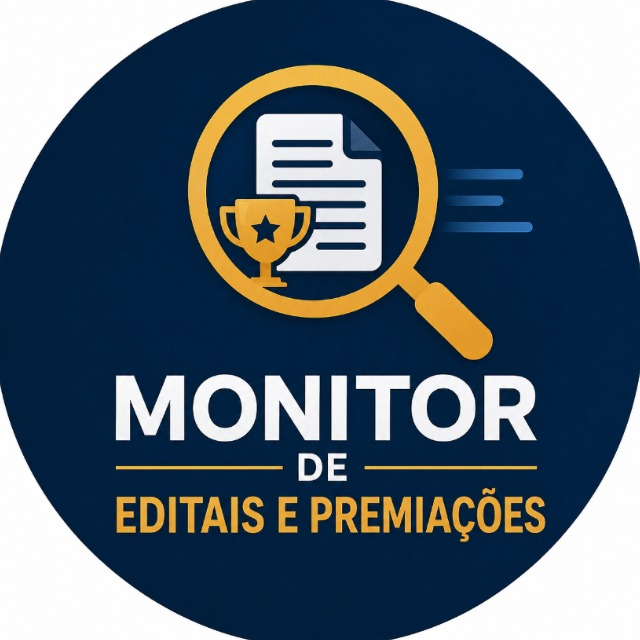
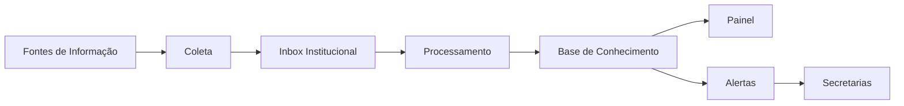
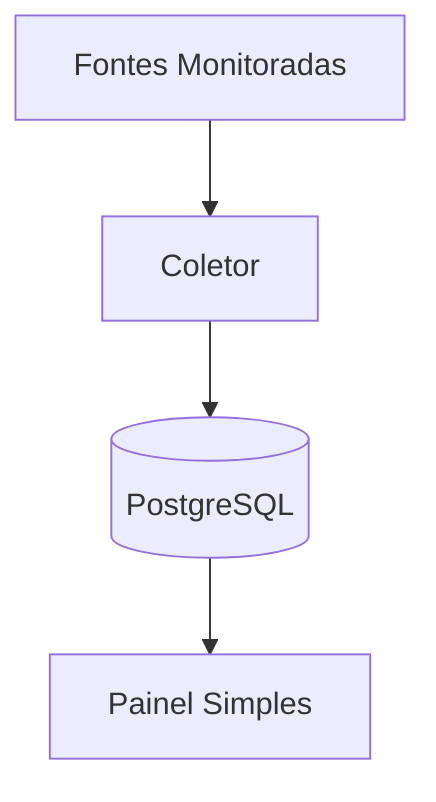
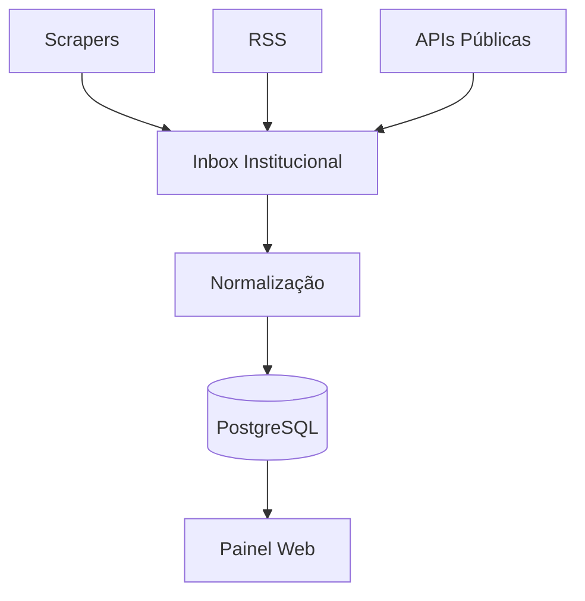
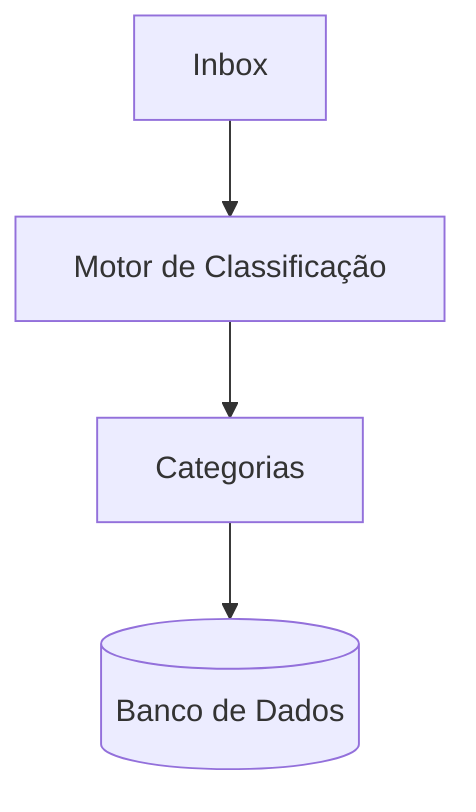
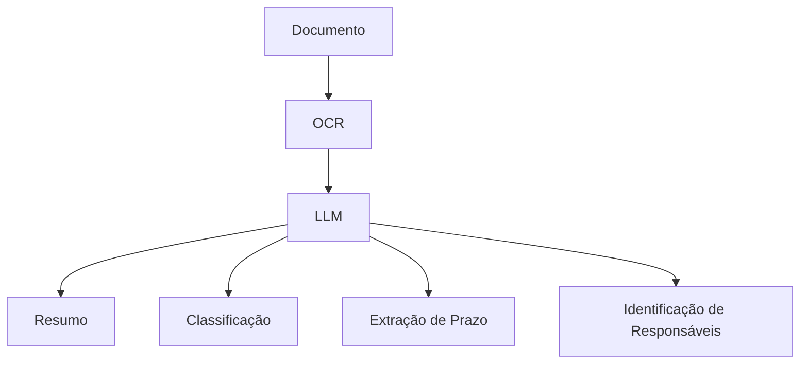
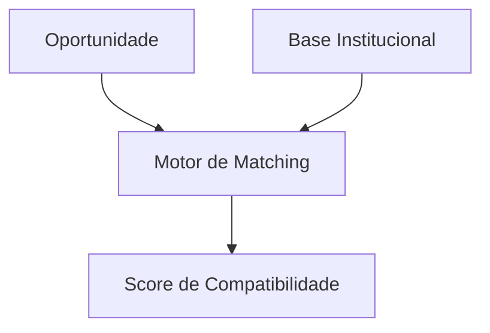
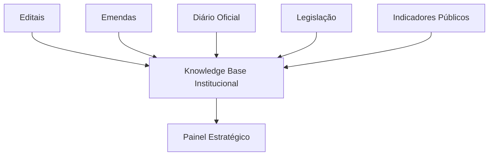
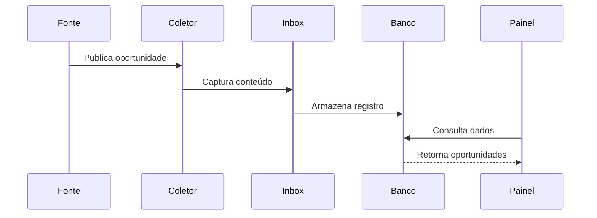

#  PoC - Observatório de Oportunidades Institucionais
<br>

## Visão Geral

O Observatório de Oportunidades Institucionais é uma plataforma voltada ao monitoramento contínuo de oportunidades externas que possam gerar benefícios para a administração pública municipal.

A proposta surgiu da necessidade de identificar de forma proativa:

* Premiações institucionais;
* Certificações;
* Programas federais;
* Programas estaduais;
* Emendas parlamentares;
* Convênios;
* Chamamentos públicos;
* Editais de financiamento;
* Programas de inovação;
* Oportunidades de captação de recursos.

A arquitetura foi inspirada em sistemas modernos de curadoria de informação, especialmente na abordagem utilizada pelo projeto M.Akita Chronicles, onde múltiplas fontes são monitoradas continuamente e consolidadas em uma base central de conhecimento.

O objetivo não é apenas realizar scraping de páginas, mas criar uma plataforma evolutiva de inteligência institucional.

---

# Visão Arquitetural



## Conceito Central

Todo conteúdo descoberto pelo sistema é tratado inicialmente como uma oportunidade potencial.

Independentemente da origem:

* Site institucional;
* Portal governamental;
* API pública;
* RSS;
* Newsletter;
* Diário Oficial;
* PDF.

Tudo é encaminhado para uma Inbox Institucional.

A Inbox torna-se o ponto único de entrada de informações para todo o sistema.

---

# Evolução Arquitetural

A construção do projeto está dividida em fases evolutivas.

Cada fase entrega valor real e prepara a base para a próxima.

---

# Fase 0 - MVP de Descoberta

## Objetivo

Validar a capacidade de localizar oportunidades automaticamente.

## Arquitetura



## Funcionalidades

* Cadastro de fontes;
* Coleta automatizada;
* Armazenamento de resultados;
* Consulta básica.

## Fora do Escopo

* IA;
* Classificação;
* Alertas;
* OCR.

## Meta

Descobrir oportunidades sem intervenção humana.

## O Que Foi Alcançado (Validação 1)
- Estruturamos o banco de dados PostgreSQL e os modelos via FastAPI/SQLModel.
- Validamos a coleta autônoma de **140 oportunidades** a partir de 8 fontes iniciais.
- Fontes de RSS (Nível A) como Transferegov, Prêmio Espírito Público, ABIPEM e Capta rodaram com 100% de sucesso.
- Fontes de API/Sitemap (Nível B) demonstraram capacidade de parsing complexo e lidaram bem com requisições (Google Education, ENAP).
- Criamos um Painel Simples com Jinja2 para exibir os resultados.

**Próximos Passos:** Ampliaremos os testes com as demais plataformas (Nível C e D) ainda não validadas, focando no tratamento das APIs com autenticação e parsing de HTML estático.

---

# Fase 1 - Radar Institucional

## Objetivo

Centralizar todas as oportunidades encontradas.

## Arquitetura



## Funcionalidades

* Múltiplas fontes;
* Histórico;
* Deduplicação;
* Filtros;
* Pesquisa.

## Estrutura mínima de dados

```text
Título
Descrição
Fonte
Categoria
Data de Publicação
Prazo
URL
Status
```

## Meta

Não perder nenhuma oportunidade relevante.

---

# Fase 2 - Curadoria Automatizada

## Objetivo

Reduzir a necessidade de análise manual.

## Arquitetura



## Categorias iniciais

* Premiações;
* Certificações;
* Emendas;
* Convênios;
* Educação;
* Saúde;
* Sustentabilidade;
* Inovação;
* Mobilidade.

## Estratégia Inicial

Classificação baseada em regras.

Exemplo:

```text
"Cidades Inteligentes"
→ Inovação

"Mobilidade Urbana"
→ Mobilidade

"Gestão Ambiental"
→ Sustentabilidade
```

## Meta

Reduzir o volume de triagem manual.

---

# Fase 3 - Assistente de IA

## Objetivo

Compreender automaticamente o conteúdo encontrado.

## Arquitetura



## Capacidades

* Resumo automático;
* Classificação semântica;
* Extração de datas;
* Extração de requisitos;
* Identificação da secretaria responsável.

## Exemplo

Entrada:

```text
Programa de Cidades Sustentáveis
```

Saída:

```text
Categoria: Sustentabilidade

Prazo: 30/09/2027

Responsável sugerido:
Secretaria de Urbanismo

Resumo:
Programa voltado ao financiamento de ações ambientais urbanas.
```

## Meta

Entender o conteúdo das oportunidades.

---

# Fase 4 - Matching Institucional

## Objetivo

Avaliar aderência entre oportunidades e a realidade municipal.

## Arquitetura



## Exemplos

```text
Programa Federal XYZ

Compatibilidade:
87%

Secretaria:
Mobilidade Urbana

Pendências:
Plano Municipal atualizado
```

## Meta

Priorizar oportunidades com maior potencial de sucesso.

---

# Fase 5 - Centro de Inteligência Institucional

## Objetivo

Transformar o observatório em uma plataforma estratégica.

## Arquitetura



## Novas Capacidades

* Monitoramento legislativo;
* Monitoramento orçamentário;
* Acompanhamento de programas federais;
* Monitoramento de indicadores;
* Apoio à tomada de decisão.

## Meta

Disponibilizar inteligência institucional para toda a administração.

---

# Arquitetura Tecnológica Inicial

## Backend

* Python
* FastAPI

## Coleta

* Requests
* BeautifulSoup
* Playwright

## Banco de Dados

* PostgreSQL

## Frontend

* React
* Next.js

## Infraestrutura

* Docker
* Docker Compose
* Nginx

---

# Fluxo Operacional da PoC



---

# Objetivo da PoC

Demonstrar a viabilidade técnica de um sistema capaz de monitorar automaticamente fontes públicas e consolidar oportunidades institucionais em uma plataforma única.

O sucesso da PoC será medido pela capacidade de:

* Descobrir oportunidades automaticamente;
* Consolidar informações em uma única base;
* Reduzir a dependência de monitoramento manual;
* Permitir expansão futura para IA e inteligência institucional.

