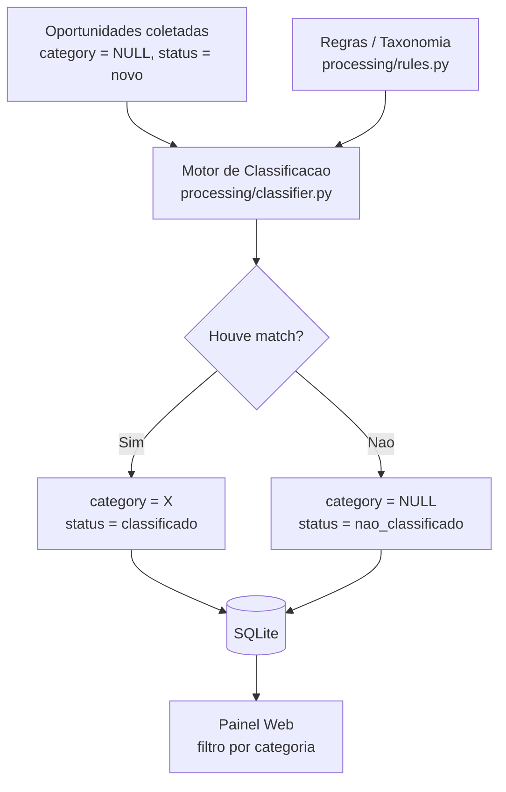

# Plano de Implementação — Fase 2: Curadoria Automatizada

Este documento detalha o plano da **Fase 2** (Curadoria Automatizada), construindo sobre a base entregue nas Fases 0 e 1. Referência de roadmap: `README.md`. Issues relacionadas: **#6** (motor de regras), **#7** (taxonomia), **#8** (transição de status).

---

## Objetivo

Reduzir a necessidade de triagem manual classificando automaticamente as oportunidades por **categoria**, usando uma estratégia **baseada em regras** (palavras-chave) — **sem IA** (LLM/OCR ficam para a Fase 3).

## Contexto / Ponto de partida

- As Fases 0 e 1 já entregam coleta autônoma, normalização, deduplicação e painel com busca/filtros.
- O modelo `Opportunity` já possui os campos da Fase 1: `category`, `deadline`, `status` (default `novo`).
- A camada de normalização (`processing/normalizer.py`) já padroniza título/descrição/URL antes de persistir.
- Hoje as oportunidades coletadas têm `category = NULL` e `status = "novo"` — prontas para classificação.

## Arquitetura

O motor roda como **script autônomo** (mesmo padrão dos coletores: executável por cron/CI, desacoplado da API), num **passo separado da coleta** — re-executável para reclassificar quando as regras evoluírem.

## Componentes

### 1. `processing/rules.py` (issue #7)
Mapa **ordenado** `categoria → [palavras-chave]`, com as 9 categorias iniciais do README:
`Premiações, Certificações, Emendas, Convênios, Educação, Saúde, Sustentabilidade, Inovação, Mobilidade`.
A ordem importa: a **primeira** categoria com palavra-chave casada vence.

### 2. `processing/classifier.py` (issues #6 e #8)
- `classify_text(title, description) -> Optional[str]`: concatena e normaliza o texto (lowercase, **remoção de acentos** via `unicodedata`) e retorna a primeira categoria correspondente, ou `None`.
- `classify_pending()`: varre oportunidades com `category IS NULL`, aplica `classify_text`, define `category` e atualiza `status`:
  - **com match** → `status = "classificado"`;
  - **sem match** → `status = "nao_classificado"` (permanece visível no painel para curadoria manual).
- Idempotente: re-execuções não duplicam efeitos; só processa o que ainda está pendente.

### 3. Painel
Sem mudança de UI necessária — o filtro por categoria da Fase 1 já exibe o resultado.

## Estratégia de classificação

- **Baseada em regras** por correspondência de palavra-chave (substring no texto normalizado).
- **Primeira correspondência por prioridade** (ordem do dicionário de regras).
- **Sem match → `nao_classificado`**: torna explícito o que precisa de revisão humana, em vez de "esconder" em `NULL`.

## Fora do escopo (Fase 3+)

- Classificação semântica / LLM, OCR, extração de prazos e responsáveis.
- Matching institucional (Fase 4).

## Critérios de aceite (consolidados)

- [ ] `processing/rules.py` com as 9 categorias e palavras-chave (#7).
- [ ] `processing/classifier.py` autônomo e re-executável, preenchendo `category` (#6).
- [ ] Transição de `status` novo → classificado / nao_classificado (#8).
- [ ] Testes com exemplos conhecidos cobrindo as categorias principais.
- [ ] Resultado visível e filtrável no painel.

## Validação

Rodar o classificador sobre a base já coletada e conferir, no painel, a distribuição por categoria e os itens `nao_classificado` (candidatos a novas palavras-chave).
